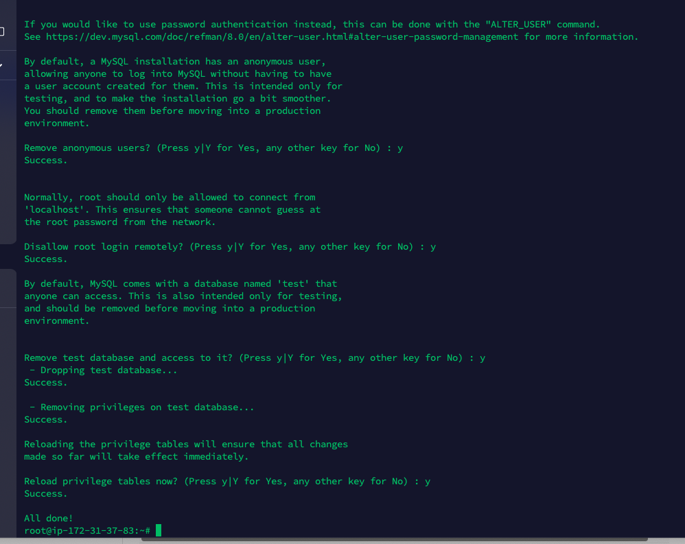

# LEMP STACK IMPLEMENTATION

## What is lemp stack?
The `Lemp stack` is a web development platform taht consist of `linux,Nginx Mysql and PHp`.
Its almost the same as `lamp`(linux, apache,Mysql and PHP/Python and perl). 

The goal of this project implementation is to understand and create a useful and dynamic environment for web development.

## STEPS FOR THE IMPLEMENTATION
- AWS sign up
- Created an EC2 instance (Elastic Compute Cloud)
- ssh to the server through the terminal
- Installing Nginx
- Installing Mysql
- Installing my PHP

This Lemp project is the continuation of `LAMP project `which i implemented, during the `LAMP`documntation i demonstrated with screenshot on how i signed up in the `AWS` and also how i was able to ssh to the server through the terminal.
Now im going to show the steps i took to implement the `LEMP` project. firstly, i updated the system by using `sudo apt update`code . This is a standard practice before carrying out any installation in a system.

## sudo apt update

In this implimentation of the project, i updated the apt to confirm it is upto date as seen in the screenshot below.

In this screenshot, i demonstrated the instalation Nginx with -y which means the system should give access and accepts all the installation of the package till its completed

Below is the `systemctl` command line thats used to view the status of the program in the system. 

$ curl http://localhost:80
or
$ curl http://127.0.0.1:80

The curl command was to request port 80. This command is used to transfer data to or from a server using various  protocols like HTTP,HTTPS etc.

## ping command

This ping command is a network utiliy used to test the reahaability of a host on an internet protocol (IP)network. It sends echo request to thetarget hostand waits for echo replypackets in response.

## Installing MySql
In this installation, i used `$ sudo apt install mysql-server`
for mysql installation. i also used y when prompted to confirm the installation.

# sudo mysql -p command
This command prompt user to input its passward in other to proceed. running sudo mysql -p in the terminal is a way to start the mysql command-line client with adminsitratibve privileges. (sudo) and prompt for the MySql root users passpword (-p).

## Configuring Nginx to use PHP procssor

In this demonstration i created a web directory for a demain.

$ sudo mkdir /var/www/projectLEMP
This sudo mkdir  commands is used to create a new directory with adminsitrativeprivileges. The sudo command allows me to execute with elevated privileges.

## Testing the PHP code with nginx
PHP is often used to create dynamic websites, process form date etc,itcan also be used to program application programming interfaces(API)
This creenshot shows it was properly installed during the demonstration.

Above are screenshots demontrtions of the projects

This is the successful implementation of nginx in this project.
in this implementation, i used sudo apt install nginx and sudo systemctl to be sure of the status of it. note that nginx main configuration file is usually located at the `/etc/nginx/nginx. cong`.

