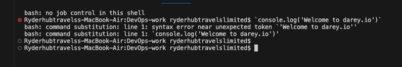

# GIT-PROJECT
## Prerequisite:

- Install git
- Create a github account 
  
  ## Initializing Git Repository

  - Open Git
  - Make directory by using `mkdir command` DevOps in the terminal

  - change directory to `DevOps` 
  - use `git init` command to initialize an empty repository

  

  ## Making First Commit

  In Git to `COMMIT` means to save changes made to a file.

  - Inside the working directory create a file `index.txt` using `touch command`

  - write `i am happy to be making my first commit` using  `echo` command

  - Add changes to git staging area by using `git add .`
  - To commit changes to git `use git command `commit -m "initial commit"

  

  ## Working wit Branches

  - To make a `new branch` used command `git checkout - b my - new - branch`

  - This command also list git branches

  - merging branch 

  - `git merge (B)` to add comment from Branch B to A
  - `git merge main`

  

- To change into old branch
- use `git checkout` (branch name)
- use git checkout main
`

## Deleting a Git Branch

- To delete a git branch : run `git branch -d`
(branch name)

## Collaboration and Remote Repositories ##

- Creating a Github account.
- To create a Github account: Visit github

## Creating first repository ##

steps :

- Click on the plus sign on the top right corner of the github account

- Click on new repository to create a new one

- add a unique name, description and tick Readme to add a readme file

## pushing local git repository to Remote git repository

- run git remote add origin (remote repository link)
- run git push origin (branch name)
- i.e `git push origin main`

 

## Branch management and tagging ##

1. To create a Heading

-  # Project 1

-  ## Project 2

- ### Project 3

2. To Create emphasis

Use asterick

- run *Italic*

- **Bold**

3. To create a list - ordered and unordered list

- **Unordered list**

- Item 1

- Item 2
- Item 3

**Ordered list**

1. First item

2. Second item

3. Third item

4. Links: To create a hyperlink.

- Run [text link](www.darey.io)

5. To display images

- Run ![Alt Text] (https://example.com/image.jpg)

6. To display code or code snippets

- ` console . log (' Welcome to darey.io)`

