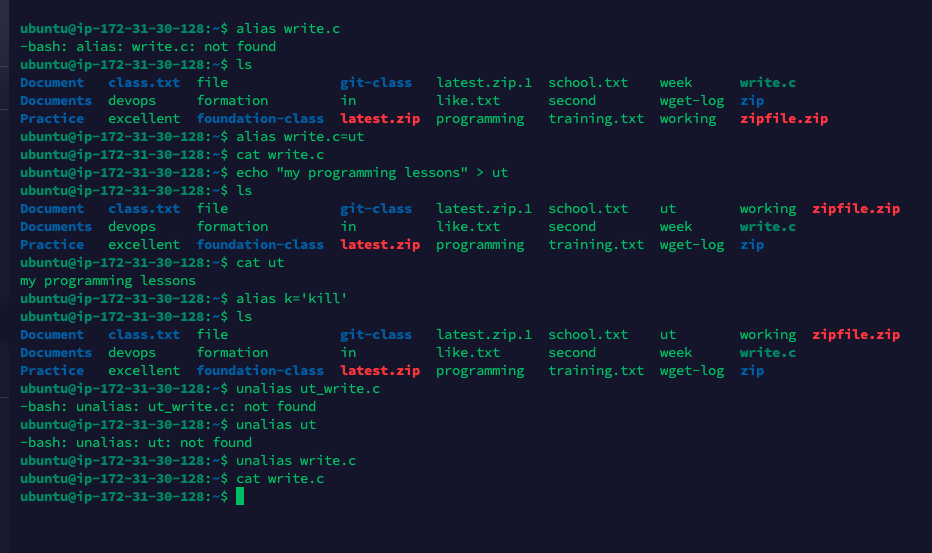

## Linux project implementation.
## What is Linux?
### Linux is an open source operating system OS software that manages a systems hardware and resources eg. cpu, memory and storage.

Below are the Linux commands in this project

 **sudo command**

 - This command is used for granting administrative  priviledges to users to make changes in folders and files.

 To use this command we use the following syntax `sudo apt upgrade`

 

 **pwd**
 
 - This command displays the current working directory. To use the command, i used `pwd syntax`
 
   pwd [option]
   

 

**cd**

- changes the current working directory to another specified by using `cd syntax`

cd [Filename]or cd 

home/ubuntu/Filename

**ls**

- ls  command lists files and directories within the system.
- ls -R: lists subdirectories recursively.
- ls -a: shows all files and its directories plus hidden files
- ls -Ih shows file sizes in an easily readable format
`ls syntax`

 

 **cat**

 - concatenate or cat command writes file content to the standard output.

 - cat filename displays the content of the file.
 - cat filename1.txt filename2.txt > filename3.txt, merges filename1.txt and filename2.txt and stores theoutput in filename3.txt
 - To perform this command i used `cat syntax`

 

 **tac**
 - displays content in reverse order.

**cp**

- This command is used to copy files or directories and their contents
- cp file1 file2
- cp -R foundation-tutoring/ numberdoc/

`cp syntax` to perform the command

**mv**

- This command is used primarily to move and rename files and directories, it does not produce an output upon execution.

 - mv sqlite-commands1 foundation-tutoring
 `mv syntax` to write the command

 **mkdir**

 - This command is use to create one or multiple directories at once and set their permission for each of them. The executor must have the permission to make new folder in the parent directory or it may be denied.

 

 **rmdir**

 - this permanently delete an empty directory.
 - using `rmdir syntax` to perform the command

 

**rm**

- The rm command is used to delete files within a directory. I used `rm syntax` to write the command

**touch**

- touch command allows you to create an empty file or generate and modify a timestamp in the linux command line.
- I used `touch syntax` to write the command 

**locate**
- This command can find a file in the database system
- adding -i will turn off case sensitivity and search for a any file even without remembering the exact name.
`loacte syntax` was used to write the command

**find**

- This command is use to search for a file within a specific directory and perform subsequent operations.
This was successfully done using `find syntax`

**grep**

- grep is an important command-line utility in linux used for searching text partterns within files or command output. it stands for global expression print. I used `grep syntax` command 

**df**

- df command stands for data duplicate, it is used to check disk space usage, shown in percentage and kilobyt. To carry out the command i used `df syntax`

 

**du**

- used to check how much space a file or a directory takes up.the command can be run to check which part of the system uses the storage excessively. I used `du syntax` 

**head**

- The head command allows you to view the first ten lines of a text. additional option kets you change the number of lines shown

`head syntax`

**tail**

- The tail command displays the last ten lines of the file. It allows users to check whether a file has new data or to read error messages

**diff**
- The commands compares two contents of a file line by line, then display the parts that does not match. I used `diff syntax`

**tar**

- This command archives multiple files into a TAR file. i used `tar syntax`

**chmod**

- This is a common cammand that modifies a file or directory's read, write and execute permissions. A file is associated with three user classes in Linux. owner, group member and others. I used `chmod syntax`

**chown**

- This helps change the ownership of a file, directory or symbolic link to a specified username. I used `chown syntax`

**jobs**

- This command will display all the running processes along with their statuses. The syntax i used 

**kill**

- This command is used to terminate an unresponsive program manually. it'll automatically signal misbehaving applications and instruct them to close their processes.

I used `kill command ` for this.

`ps au`
`kill [signal_option] pid`
`kill SIGKILL 63773`

**ping**

This command is used to confirm connection to a site and also to measure its response time. i used syntax `ping google.com`

**wget**

- This linux command allows downloads from the internet, it works in the background without hindering other running processes.
`wget syntax command` was used to a achieve this.

![wget]

**uname**

The uname command or unix command will print detailed information about your linux system and haardware. This includes the machine name, operating system and kernel. I used the syntax`uname syntax` to perform this.

**top**

- This comman will display the running processes and a dynamic real-time view of the current system.it sums up the resource utilization from CPU to memory usage. I used `top syntax` to run the command.

**history**

- This command will list up to 500 previously executed commands allowing you to reused them without re-entering. This priveledge is only given to a user with sudo permit. This processes depends on which linux shell you use.

`history syntax` i used.

**man**

- This command provides user manual of any commands or utilities you can run in Terminal including the name, description and options.

- Its consists of 9 sections;
- Executable programs or shell commands, system calls, Library calls, Games Special Files, File formats and conventions System, Administrative commands Kernel routine, Miscellaneous to display the complete manual.

-`man [command_name]`
- `man ls`
- `man 2 ls`
- `man [option ][section_number][command_name]`

**echo**

- This is a built-in utility that displays a line of text or string using the standard output.
- to dispaly this command i used `echo syntax`
- `echo [option] [string]`

**zip, unzip**

These commands are used to compress your files into a ZIP file, a universal format commonly used on Linux. it can automatically chossse the best compression ratio. It can also be useful in archieving files and directoies and redcing disk usage.
I used the `zip syntax command` to run the command

**hostname**

- This commnand is used to know the system's hostname. it can be eecuted with or without an option.
`hostname syntax` is the syntax used to run the command.
It has many optional flags to use, eg -a or a alias dispalys the hostname's alias: A or -all-fqdns displays the machine's Fully Qualified Domain (FQDN); -i or -ip-address displays the machine's IP address.

**useradd,userdel**

- Linux is a multi-user system, meaning many people can use it simultaneously, useradd is used to create new user account, while the password comands allows you to add a passward. only those with root privileges can run the useradd command.

`useradd [option] username`
To set passord;

`passwd the_password_combination`

**apt-get**

- apt-get is a command line tool for handling Advanced Package Tool (APT) libraries in Linux. Its used in retrieving information and bunbles fron authenticated sources to manage, update, remove and install software and its dependencies.
`apt-get`syntax used to run the command
`apt-get [options](command)`

**nano,vi,jed commands**

- Linux allows users to edit and manage files via a text editor, such as nano vi or jed. nano and vi editor comes with the operating system while jed hs to be installed. nano can with most languages.
`nano syntax`was used to carry out this command
`nano filename`

**alias, unalias commands**

- This command allows you to reate a shortcut with the same funtioonality as a command, file name or text. It instructs the shell to replace on string with another. 
`alias Name- String`
`alias k-`'kill'
`unalias [alias_name]`

**su command**

- Su commands allows you to run a command or a program as a different user. It changes the adminsitrative account tin the current log- in session. This command is beneficial for accessing the system through SSH or using the GUI display manager when the root user is unavailable.

`su syntax `was used to run this commnand.
`su [option][username][argument]`

**htop command**

- This is an interactive program that monitors system resources and server processes in real time. It is available on most Linux distributions and can be install using defaut package manager.
`htop syntax` was used for this 

`htop [option]`

**ps command**

- This command produces a snapshot of all runnung processes in your system.The static results are taken from th virtual fies in the /proc file system.

`ps command syntax` was used 

This command was executed without an option or argument, thereby listing all the runnung processes in the shell along with; 
`PID`
`TTY`
`TIME`
`CMD`

